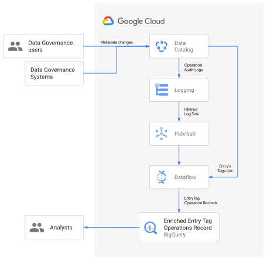
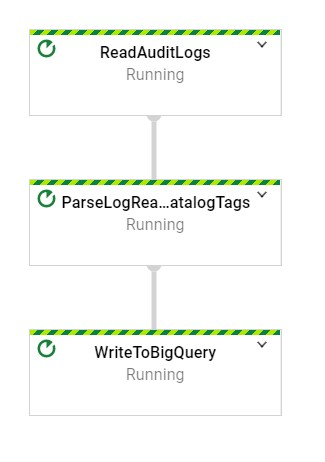

## Record Data Catalog Tags changes to BigQuery in real-time

- [Concepts](#concepts)
- [Prerequisites](#prerequisites)
- [Objectives](#objectives)
- [Costs](#costs)
- [Before you begin](#before-you-begin)
- [Setting up your environment](#setup-environment)
- [Creating resources](#creating-resources)
  * [Create BigQuery table](#setup-bigquery)
  * [Configure Pub/Sub topic and subscription](#configure-pubsub)
  * [Configure Log sink](#configure-log-sink)
  * [Create Service Accounts](#create-service-account)
- [Deploy the Entry Tags recording pipeline](#launch-pipeline)  
- [Manual Test](#manual-test)
- [Limitations](#limitations)
- [Cleaning up](#cleanup)
  * [Delete the project](#delete-project)
- [License](#license)

Historical metadata of your data-warehouse is a treasure trove to discover not just insights about changing data patterns, but also quality and user behavior. The challenge is Data Catalog keeps a single version of metadata for fast searchability.

This solution is intended for technical people with responsibility for metadata management, data governance and related analytics.

This tutorial suggests a solution to create a historical record of metadata Data Catalog tags by creating change records in real-time through capture and parsing of the [Audit Logs](https://cloud.google.com/data-catalog/docs/how-to/audit-logging) from [Cloud Logging](https://cloud.google.com/logging) and processing them in real-time by using [Pub/Sub](https://cloud.google.com/pubsub) and [Dataflow](https://cloud.google.com/dataflow) to append into a [BigQuery](https://cloud.google.com/bigquery) table for historical analysis.



<table>
  <tr>
   <td> <b>Warning<b>
   </td>
  </tr>
  <tr>
   <td>Apply restrictive access controls to the Tag history BigQuery table.
<br>
<em>Data Catalog</em> results are ACLed based on requestors' permissions
   </td>
  </tr>
</table>

### Concepts<a name="concepts"></a>

*   [Cloud Data Catalog](https://cloud.google.com/data-catalog) provides a single plane for searching and managing both [Technical and Business metadata](https://cloud.google.com/data-catalog/docs/concepts/overview#glossary) of your data-warehouse/data-lake in Google Cloud and beyond. Data Catalog uses [Tags](https://cloud.google.com/data-catalog/docs/concepts/overview#tags) to organize metadata and makes it discoverable.
*   [BigQuery](https://cloud.google.com/bigquery) is Google Cloud’s Serverless, highly scalable, and cost-effective multi-cloud data warehouse designed for business agility, that you can use to run petabyte sized queries. BigQuery also provides APIs for reading Table schema.
*   [Dataflow](https://cloud.google.com/dataflow) is Google Cloud’s Serverless data processing service by both stream and batch.
*   [Pub/Sub](https://cloud.google.com/pubsub) is Google Cloud’s flexible, reliable, real-time messaging service for independent applications to publish and subscribe to asynchronous events.


### Prerequisites<a name="prerequisites"></a>

This tutorial assumes some familiarity with Shell scripts and basic knowledge of Google Cloud Platform.

### Objectives<a name="objectives"></a>

1. Setup Log sink to export Data Catalog Audit logs to PubSub
2. Deploy a streaming Dataflow pipeline to parse the logs
3. Enrich the logs with Entry Tag information from Data Catalog
4. Store the metadata tags attached to the modified Entry in a BigQuery table for historical reference


### Costs<a name="costs"></a>

This tutorial uses billable components of Google Cloud, including

*   [Data Catalog](https://cloud.google.com/data-catalog/pricing)
*   [Cloud Dataflow](https://cloud.google.com/dataflow/pricing)
*   [Cloud PubSub](https://cloud.google.com/pubsub/pricing)
*   [Cloud Logging](https://cloud.google.com/logging/pricing)
*   [Cloud Storage](https://cloud.google.com/storage/pricing)
*   [BigQuery](https://cloud.google.com/bigquery/pricing)
    *   Streaming API
    *   Storage

Use the [Pricing Calculator](https://cloud.google.com/products/calculator) to generate a cost estimate based on your projected usage.

### Before you begin<a name="before-you-begin"></a>

For this tutorial, you need a Google Cloud [project](https://cloud.google.com/resource-manager/docs/cloud-platform-resource-hierarchy#projects). You can create a new one, or select a project you already created.

1. Select or create a Google Cloud project from the [project selector page](https://console.cloud.google.com/projectselector2/home/dashboard)
2. Make sure that billing is enabled for your Google Cloud project
    *   [Enable billing](https://support.google.com/cloud/answer/6293499#enable-billing) for your project
3. Enable APIs for Data Catalog, BigQuery, Pub/Sub, Dataflow and Cloud Storage services

    [ENABLE THE APIS](https://console.cloud.google.com/flows/enableapi?apiid=datacatalog,bigquery,pubsub,storage_component,dataflow)

    You can use shell to enable required Google Cloud services.

    ```shell script
    gcloud services enable \
    bigquery.googleapis.com \
    storage_component \
    datacatalog.googleapis.com \
    dataflow.googleapis.com \
    pubsub.googleapis.com
    ```  

4. In the Google Cloud Platform Console, go to Cloud Shell.

   [GO TO CLOUD SHELL](https://console.cloud.google.com/?cloudshell=true)

   At the bottom of the GCP Console, a [Cloud Shell](https://cloud.google.com/shell/docs/features) session opens and displays a command-line prompt. Cloud Shell is a shell environment with the Cloud SDK already installed, including the [gcloud](https://cloud.google.com/sdk/gcloud/) command-line tool, and with values already set for your current project. It can take a few seconds for the session to initialize.

### Setting up your environment<a name="setup-environment"></a>

1. In Cloud Shell, clone the source repository:

    ```shell script
    git clone https://github.com/GoogleCloudPlatform/datacatalog-tag-history.git
    cd datacatalog-tag-history/
    ```

    Use your favourite editor to modify the env.sh file to set following variables.

    ```shell script
    # The GCP project to use for this tutorial
    export PROJECT_ID="your-project-id"

    # The BigQuery region to use for Tags table
    export BIGQUERY_REGION=""

    # The name of the BigQuery Dataset to create the Tag records table
    export DATASET_ID=""

    # The name of the BigQuery table for Tag records
    export TABLE_ID="EntityTagOperationRecords"

    # The Compute region to use for running Dataflow jobs and create a temporary storage bucket
    export REGION_ID=""

    # define the bucket id
    export TEMP_GCS_BUCKET=""

    # define the name of the Pub/Sub log sink in Cloud Logging
    export LOGS_SINK_NAME="datacatalog-audit-pubsub"

    #define Pub/Sub topic for receiving AuditLog events
    export LOGS_SINK_TOPIC_ID="catalog-audit-log-sink"

    # define the subscription id
    export LOGS_SUBSCRIPTION_ID="catalog-tags-dumper"

    # name of the service account to use (not the email address)
    export TAG_HISTORY_SERVICE_ACCOUNT="tag-history-collector"
    export TAG_HISTORY_SERVICE_ACCOUNT_EMAIL="${TAG_HISTORY_SERVICE_ACCOUNT}@$(echo $PROJECT_ID | awk -F':' '{print $2"."$1}' | sed 's/^\.//').iam.gserviceaccount.com"
    ```

2. Set the variables in environment

    ```shell script
    source env.sh
    ```

### Creating resources<a name="create-resources"></a>

#### Create BigQuery table<a name="setup-bigquery"></a>

1. Setup BigQuery dataset to store Entry's tags when a change event occurs.

    Create a new BigQuery dataset to store in the [region](https://cloud.google.com/bigquery/docs/locations) of your choice

    ```shell script
    bq --location ${BIGQUERY_REGION} \
    --project_id=${PROJECT_ID} \
    mk --dataset ${DATASET_ID}

    ```

2. Create a Bigquery table for storing Tags using the provided schema, this creates a BigQuery table with `lowerCamelCase` column names.

    ```shell script   
    bq mk --table \
    --project_id=${PROJECT_ID} \
    --description "Catalog Tag snapshots" \
    --time_partitioning_field "reconcileTime" \
    "${DATASET_ID}.${TABLE_ID}" camelEntityTagOperationRecords.schema
    ```


    > Use the following command if you want `snake_case` column names
    > ```shell script
    > bq mk --table \
    > --project_id=${PROJECT_ID} \
    > --description "Catalog Tag snapshots" \
    > --time_partitioning_field "reconcile_time" \
    > "${DATASET_ID}.${TABLE_ID}" snakeEntityTagOperationRecords.schema
    > ```

#### Configure Pub/Sub topic and subscription<a name="configure-pubsub"></a>

Pub/Sub is Google Cloud's global messaging bus for decoupling processing modules.

1. Create Pub/Sub topic to receive Audit log events

    ```shell script
    gcloud pubsub topics create ${LOGS_SINK_TOPIC_ID} \
    --project ${PROJECT_ID}
    ```

2. Create a new Pub/Sub subscription
   Using a subscription (instead of direct topic) with a Dataflow pipeline, ensures that all messages are processed even when the pipeline may be temporarily down for updates or maintenance.

    ```shell script
    gcloud pubsub subscriptions create ${LOGS_SUBSCRIPTION_ID} \
    --topic=${LOGS_SINK_TOPIC_ID} \
    --topic-project=${PROJECT_ID}
    ```

#### Configure Log sink<a name="configure-log-sink"></a>

[Cloud Logging](https://cloud.google.com/logging) is GCP's powerful log management control plane.

Create a Log sink to send DataCatalog audit events to the Pub/Sub topic, Cloud Logging will push new Data Catalog AuditLogs to the Pub/Sub topic for processing in real-time. \

```shell script
gcloud logging sinks create ${LOGS_SINK_NAME} \
pubsub.googleapis.com/projects/${PROJECT_ID}/topics/${LOGS_SINK_TOPIC_ID} \
--log-filter="protoPayload.serviceName=\"datacatalog.googleapis.com\" \
AND protoPayload.\"@type\"=\"type.googleapis.com/google.cloud.audit.AuditLog\""
```

Give Pub/Sub "Publisher" permission to the logging service account to enable pushing log entries into the configured Pub/Sub topic.

```shell script
# Identify the Logs writer service account  
export LOGGING_WRITER_IDENTITY="$(gcloud logging sinks describe ${LOGS_SINK_NAME} --format="get(writerIdentity)" --project ${PROJECT_ID})"

# Grant Publish permission to the Logging writer
gcloud pubsub topics add-iam-policy-binding ${LOGS_SINK_TOPIC_ID} \
--member=${LOGGING_WRITER_IDENTITY} \
--role='roles/pubsub.publisher' \
--project ${PROJECT_ID}
```

### Create Service Accounts<a name="create-service-account"></a>

It is recommended to run pipelines with fine-grained access control to improve access partitioning.
If your project does not have a user-created service account create one using following instructions.

> You can use your browser by navigating to **IAM & Admin > [Service accounts](https://console.cloud.google.com/projectselector/iam-admin/serviceaccounts?supportedpurview=project)** on the Google Cloud console

1. Create a service account to use as the user-managed controller service account for Dataflow.

    ```shell script
    gcloud iam service-accounts create  ${TAG_HISTORY_SERVICE_ACCOUNT} \
    --description="Service Account to run the DataCatalog tag history collection and recording pipeline." \
    --display-name="Data Catalog History collection account"
    ```
2. Create a custom role with required permissions for accessing BigQuery, Pub/Sub, Dataflow and Data Catalog    
    ```shell script
    export TAG_HISTORY_COLLECTOR_ROLE="tag_history_collector"

    gcloud iam roles create ${TAG_HISTORY_COLLECTOR_ROLE} --project=${PROJECT_ID} --file=tag_history_collector.yaml
    ```

3. Apply the custom role to the service account
    ```shell script
    gcloud projects add-iam-policy-binding ${PROJECT_ID} \
    --member="serviceAccount:${TAG_HISTORY_SERVICE_ACCOUNT_EMAIL}" \
    --role=projects/${PROJECT_ID}/roles/${TAG_HISTORY_COLLECTOR_ROLE}
    ```

4. Assign `dataflow.worker` role to allow the service account to run as dataflow worker.
    ```shell script
    gcloud projects add-iam-policy-binding ${PROJECT_ID} \
    --member="serviceAccount:${TAG_HISTORY_SERVICE_ACCOUNT_EMAIL}" \
    --role=roles/dataflow.worker
    ```

### Deploy the Tag history recording pipeline<a name="launch-pipeline"></a>

1. Create a Cloud storage bucket as a temporary and staging bucket for Dataflow.

    ```shell script
    gsutil mb -l ${REGION_ID} \
    -p ${PROJECT_ID} \
    gs://${TEMP_GCS_BUCKET}
    ```

2. Launch Dataflow pipeline using Maven command    

    ```shell script
    mvn clean generate-sources compile package exec:java \
      -Dexec.mainClass=com.google.cloud.solutions.catalogtagrecording.PipelineLauncher \
      -Dexec.cleanupDaemonThreads=false \
      -Dmaven.test.skip=true \
      -Dexec.args=" \
    --streaming=true \
    --project=${PROJECT_ID} \
    --serviceAccount=${TAG_HISTORY_SERVICE_ACCOUNT_EMAIL} \
    --runner=DataflowRunner \
    --gcpTempLocation=gs://${TEMP_GCS_BUCKET}/temp/ \
    --stagingLocation=gs://${TEMP_GCS_BUCKET}/staging/ \
    --workerMachineType=n1-standard-1 \
    --region=${REGION_ID} \
    --tagsBigqueryTable=${PROJECT_ID}:${DATASET_ID}.${TABLE_ID} \
    --catalogAuditLogsSubscription=projects/${PROJECT_ID}/subscriptions/${LOGS_SUBSCRIPTION_ID}"
    ```

    > Add `--snakeCaseColumnNames` flag when using `snake_case` column name schema in [Setup BigQuery](#setup-bigquery) step.

#### **Pipeline DAG**



### Manual Test<a name="manual-test"></a>

Follow the guide to [Attach Tag](https://cloud.google.com/data-catalog/docs/quickstart-tagging#data-catalog-quickstart-console) to a Data Catalog Entry to verify that the tool captures all the Tags attached to modified Entry.


### Limitations<a name="limitations"></a>

*   This implementation handles only the operations listed below.
    *   `CreateTag`
    *   `UpdateTag`
    *   `DeleteTag`
*   Single Data Catalog operation creates multiple tag record entries due to multiple AuditLog events
*   The tool polls the Data Catalog service for Entry/Tag information, as the audit logs don't contain change-information. This can result in some changes to an Entry/Tags getting missed.

### Cleaning up<a name="cleanup"></a>

To avoid incurring charges to your Google Cloud account for the resources used in this tutorial:

#### Delete the project<a name="delete-project"></a>

The easiest way to eliminate billing is to delete the project you created for the tutorial.

<table>
 <tr>
  <td> <b>Caution:</b> Deleting a project has the following effects:
  </td>
 </tr>
 <tr>
  <td>
   <ul>
    <li> <b>Everything in the project is deleted.</b> If you used an existing project for this tutorial, when you delete it, you also delete any other work you've done in the project.
    <li> <b>Custom project IDs are lost.</b> When you created this project, you might have created a custom project ID that you want to use in the future. To preserve the URLs that use the project ID, such as an <b><code>appspot.com</code></b> URL, delete selected resources inside the project instead of deleting the whole project.
   </ul>
   If you plan to explore multiple tutorials and quickstarts, reusing projects can help you avoid exceeding project quota limits.
  </td>
 </tr>
 </table>

1. In the Cloud Console, go to the **Manage resources** page.

   [Go to the Manage resources page](https://console.cloud.google.com/iam-admin/projects)

2. In the project list, select the project that you want to delete and then click **Delete**  .
3. In the dialog, type the project ID and then click **Shut down** to delete the project.

#### License<a name="license"></a>

Apache 2.0

This is not an official Google product.
